## How to set up ADB on Chromebook (for App Inventor Developers)

If you are someone using a Chromebook to build and test new components for MIT App Inventor, hopefully this resource can be a easy-to-follow step-by-step guide to using ADB (and logcat) for testing and debugging.

## Step 0: Running your MIT App Inventor app on the Chromebook

Let's start by making sure you are able connect the app you have built in MIT App Inventor to the Chromebook. You can build the app into an APK to run on the Chromebook ([instructions for how to run APKs on your Chromebook without turning on Developer Mode here](apk_on_chromebook.md)) or connect it directly using the AI2 Companion on the Chromebook's emulator. This picture shows how to connect your app via the Companion. Click "Connect" in the top menu bar. "Chromebook" should be listed as an option:

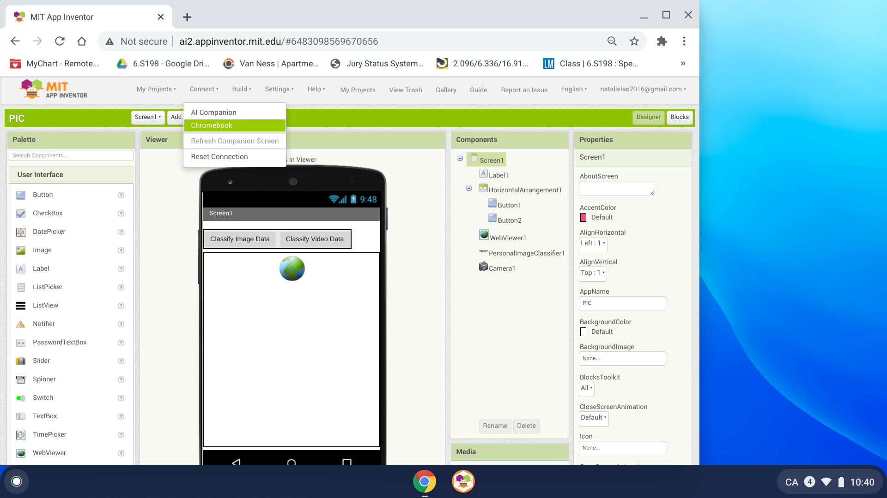

When you've clicked "Chromebook", the following notification may pop up asking if Chrome should open with the MIT AI2 Companion app. Click "Open" (you may tick "Remember my choice" as well if you'd like).

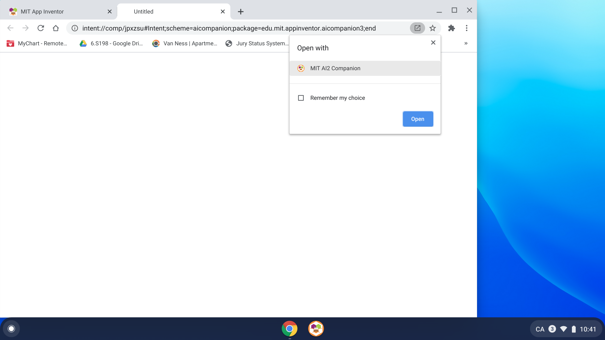

In a few seconds, the emulator should be displayed on your screen in a separate window. You may make it full-screen or adjust the window size to be similar to that of a phone (the phone-sized window is shown here):

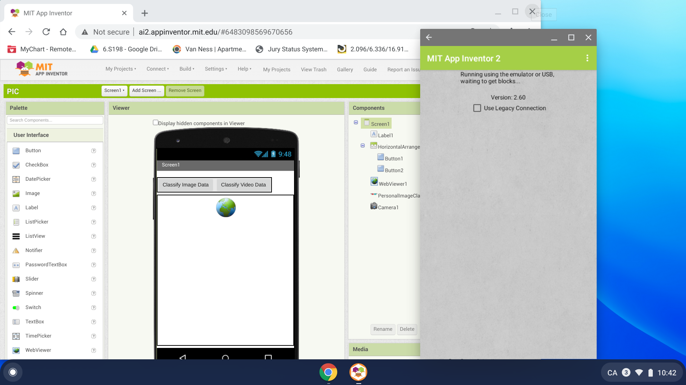

## Step 1: Making sure you have the correct Linux (Beta) settings

Now we need to make sure you have Linux turned on with the right settings for Android development. Tap or click the bottom right corner of your Chromebook where it displays the time to pull up the options and settings menu:

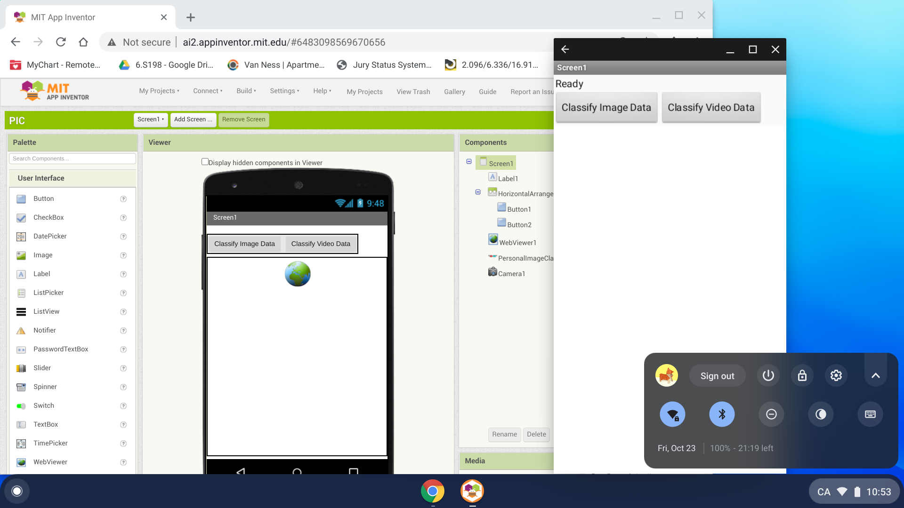

There should be a gear icon that you can tap on to access the settings. Once you do so, the full Settings menu will be displayed in a window. 

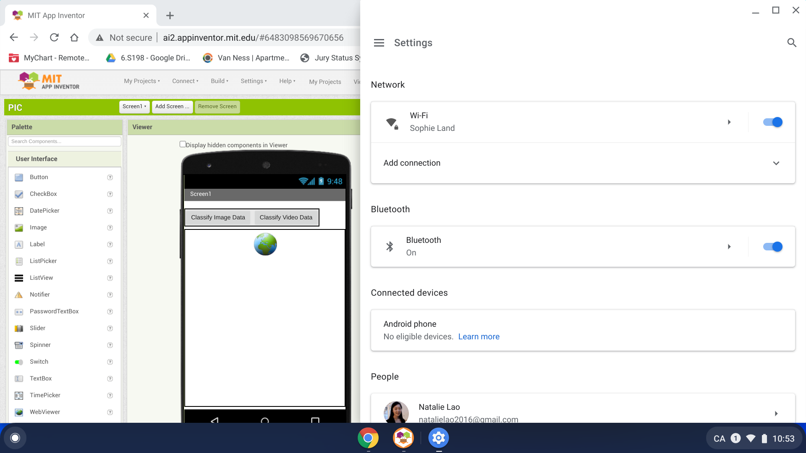

In Settings, tap or click the three horizontal lines in the top left corner to bring up the expanded menu for Settings. A side menu should pop out from the left side of the window. You should see a penguin icon and **Linux (Beta)** near the bottom of this menu:

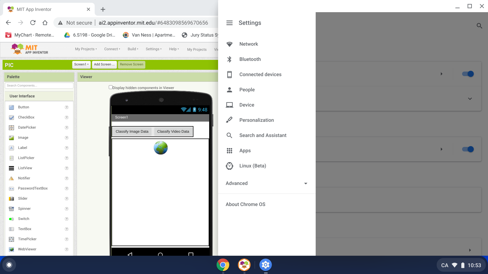

When you tap or click on **Linux (Beta)**, it should tell you if you have Linux enabled. In the screenshot below, it is enabled. If it's not enabled, you'll need to click "Turn On" and "Install" it, which may take a few minutes. 

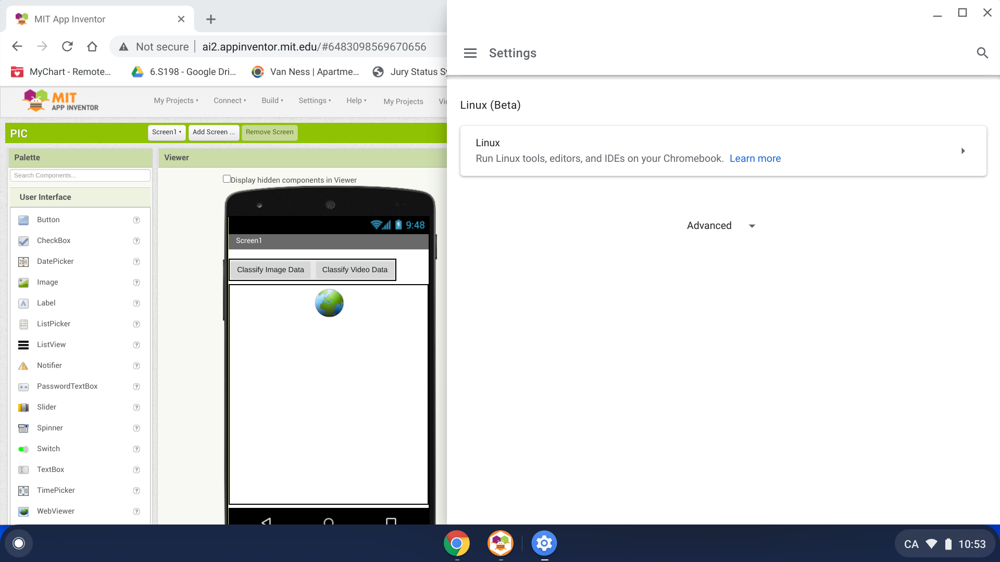

Once you have made sure that Linux is installed and enabled on your Chromebook, you can tap or click the "Linux: Run Linux tools, editors, and IDEs on your Chromebook" box to see more settings. Once you've done that, you should see an expanded menu like the one below:

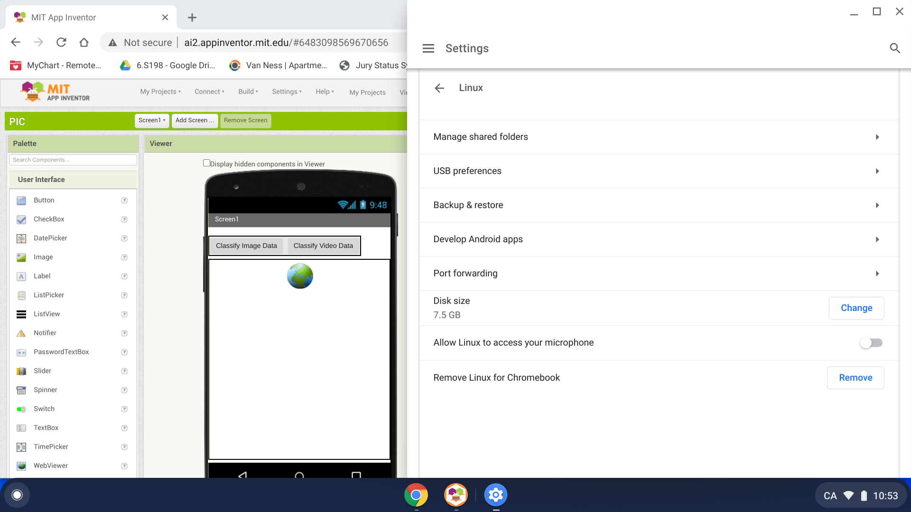

Tap or click on "Develop Android apps". This will show you whether or not ADB debugging is enabled. If the switch is gray/disabled, you'll need to enable it. This will trigger your Chromebook to restart. Once ADB debugging has been enabled, it should look like this:

## Step 2: Using ADB logcat with your MIT App Inventor app

After you have followed steps 0 and 1 to make sure that you are able to run your app and that you have the right settings on your Chromebook, you are ready to use ADB logcat. If you've closed the emulator during this process, make sure you have it open again:

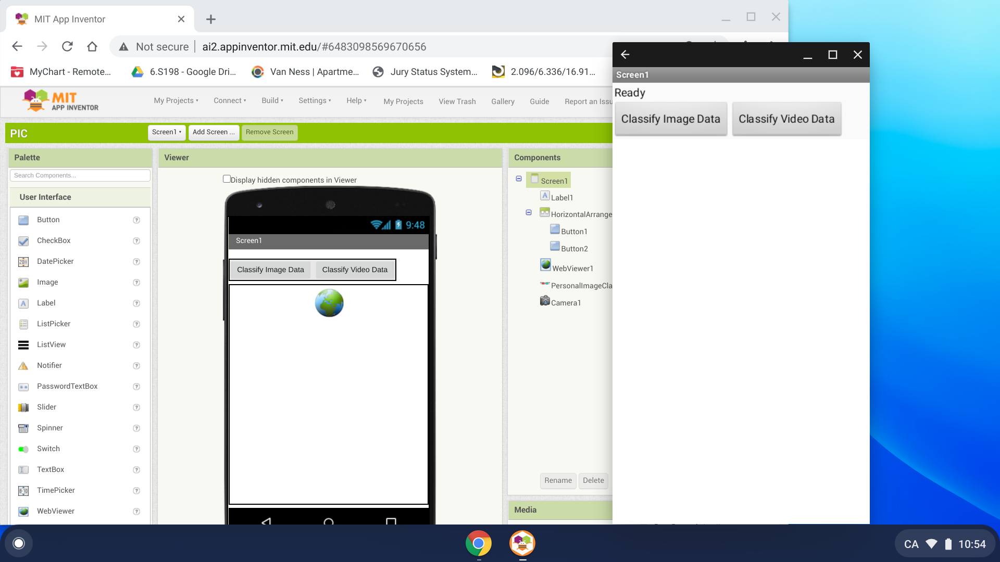

Now, tap or swipe up from the bar at the bottom of your screen to open up the Launcher. Scroll down until you see an icon called "Linux apps". If you don't see it, you can type "Linux" in the search bar of the Launcher. The icon should look similar to this:

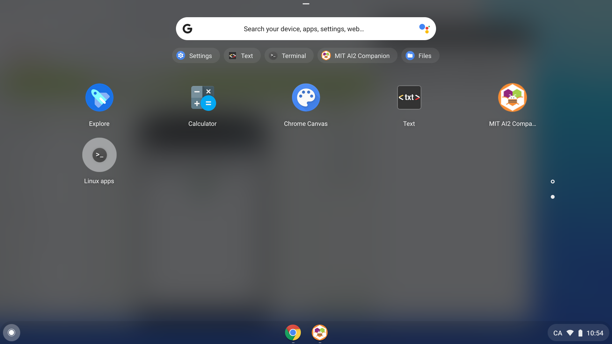

Double-click or double-tap the "Linux apps" icon to open the Linux terminal, which should open in its own window:

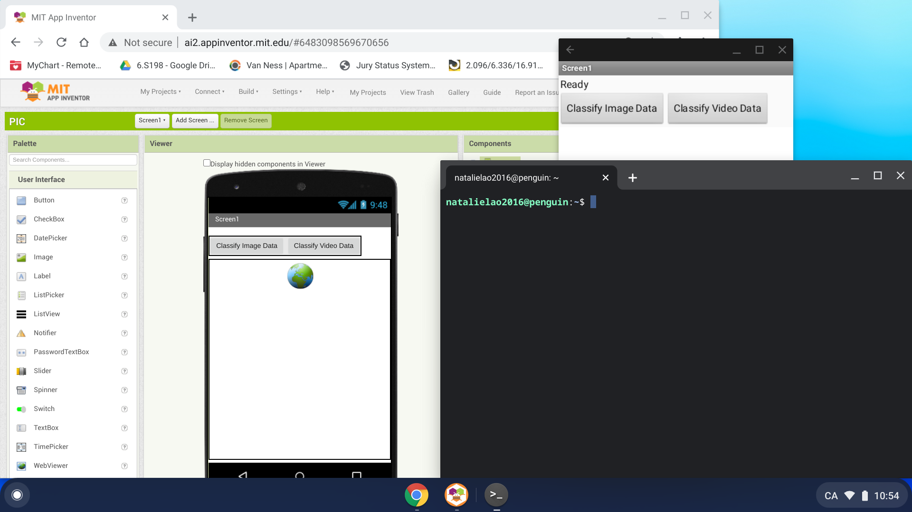

Type `adb devices` to make sure that it recognizes the emulator that you have running with your MIT App Inventor app:

Now, you can type `adb logcat` to start testing and debugging your MIT App Inventor app on your Chromebook!

