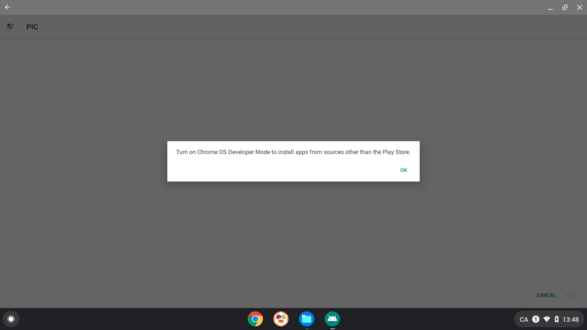
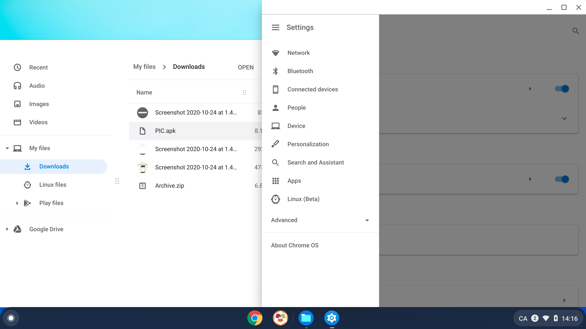
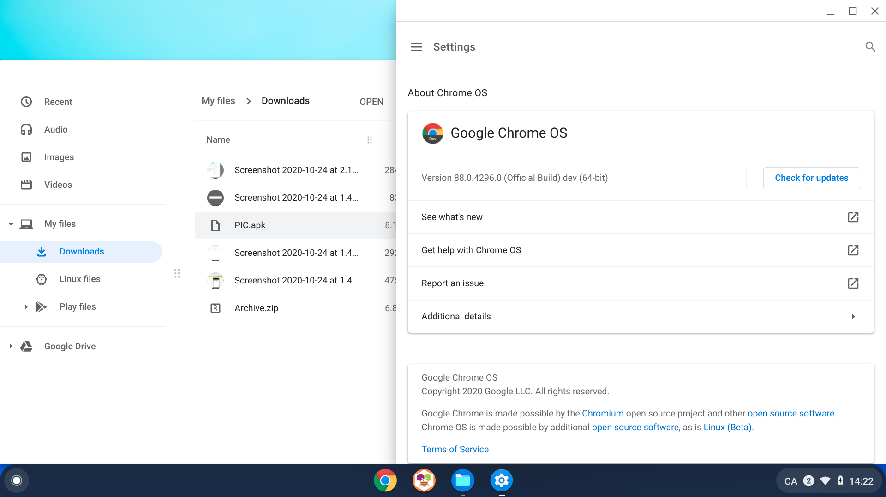
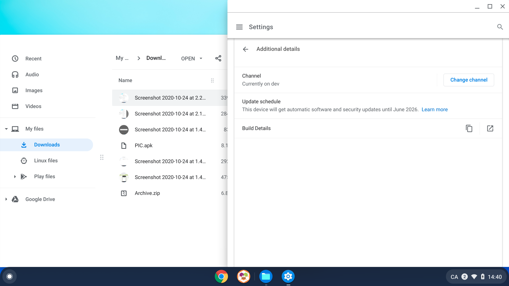
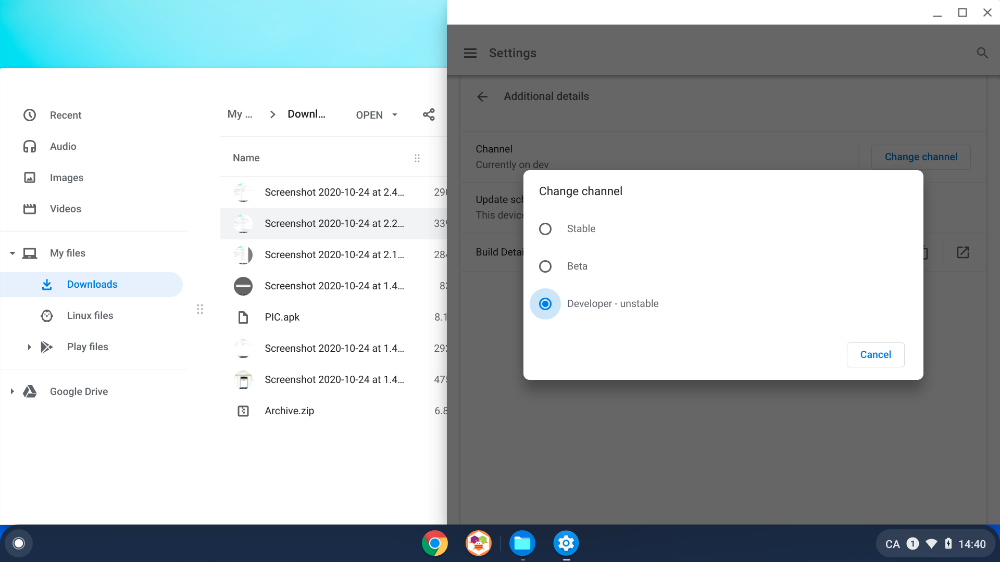
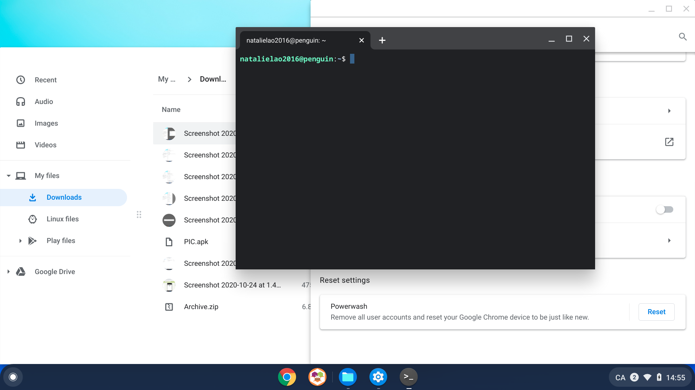
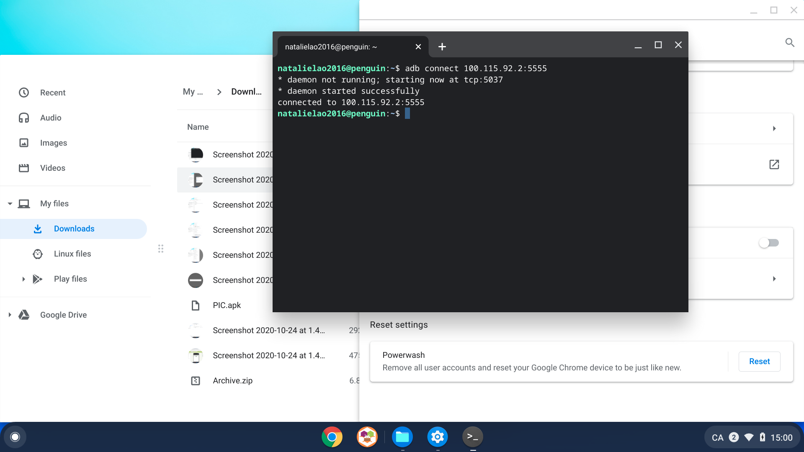
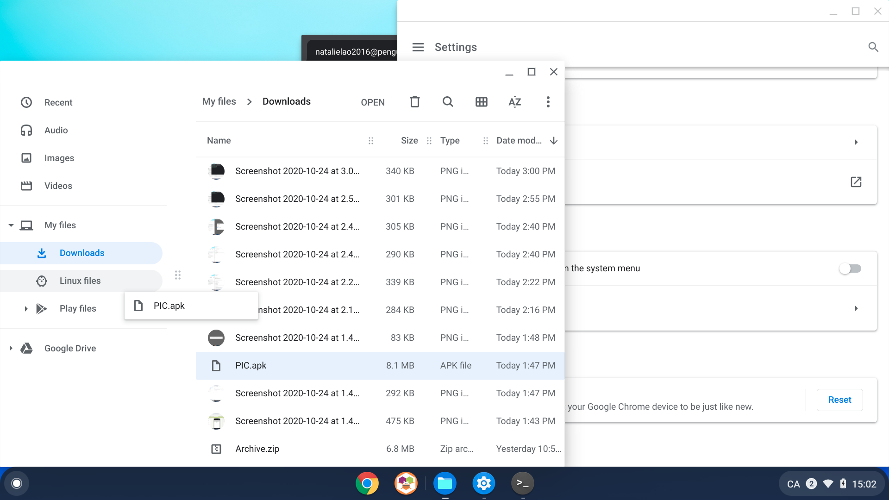
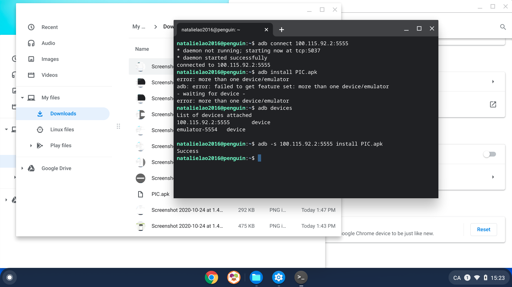
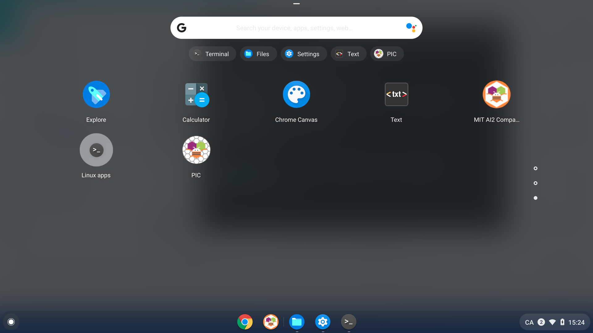

## How to download and run an APK from MIT App Inventor on a Chromebook (without turning on Developer Mode)

Say you have an APK, either created by you or someone else. This guide will go through how to do that without having to turn on Developer Mode.

## Step 0: Downloading the APK onto your Chromebook

If you go into where you downloaded the APK and try to double-click/double-tap the APK file to open it, you may see the following message:

But don't worry! There is a way to sideload your APK onto your Chromebook through Linux without turning on Developer Mode using Linux.

## Step 1: Make sure you have Linux (Beta) installed and ADB enabled

Please go through Step 1 of the [running ADB on Chromebook guide](adb_on_chromebook.md) to make sure you have Linux (Beta) with ADB debugging enabled. This step is required for sideloading.

## Step 2: Switch Chrome OS from the Stable channel to the Developer channel

You will need to switch from the default Chrome OS channel to the Developer channel -- note that this is **not** the same as turning on Developer Mode and resetting your Chromebook. The Developer channel just gives you some not-yet-released features and updates that may be buggy.

First, open Settings on your Chromebook (if you can't find Settings, look at Step 1 again, which walks through how to get there). Then, tap the hamburger/three-horizontal-line menu in the top left corner to open the expanded menu.

Tap or click the "About Chrome OS" item at the bottom of the expanded menu. This should open up information about your version of the operating system:

Now, tap or click "Additional details":

The channel that you are currently on will be listed in the first row. Here, the Chromebook is already on the developer channel, but if it doesn't say "dev", tap or click the "Change channel" button. You can select the "Developer - unstable" channel, which will start a download process that may take a few minutes. After the download is complete, you will need to restart the Chromebook to get all of the updates.

## Step 3: Sideload your APK

After you've made sure that Linux is set up and your Chrome OS is on the dev channel, you are ready to sideload your APK. First, open the Linux terminal. You can find the Linux terminal by tapping or swiping up from the bottom bar on your Chromebook and typing "Linux" in the Launcher. If you are unable to open the Linux terminal, refer to Step 2 of the [running ADB on Chromebook guide](adb_on_chromebook.md). The terminal should open and look like this:

Type `adb connect 100.115.92.2:5555` into the terminal and press Enter to start the daemon. You want to see `connected to 100.115.92.2:5555` at the end:

Now, move your downloaded APK file from where it currently is into "Linux files". Here you can see the PIC.apk being dragged from the Downloads folder into "Linux files" in the sidebar:

Go back to the Linux terminal and type `adb install <YOUR APP NAME>.apk` to install your app. If you see an error telling you that you have more than one device, type `adb devices` to see the list. You can type `adb -s <DEVICE NAME> install <YOUR APP NAME>.apk` to select which device you want to install your app on. In the screenshot below, the PIC.apk was installed onto the Linux container at 100.115.92.2:5555

Now, you can find your app through the Launcher by scrolling down or typing your app name in the search bar:

You can tap or click your app to open it at any time.
